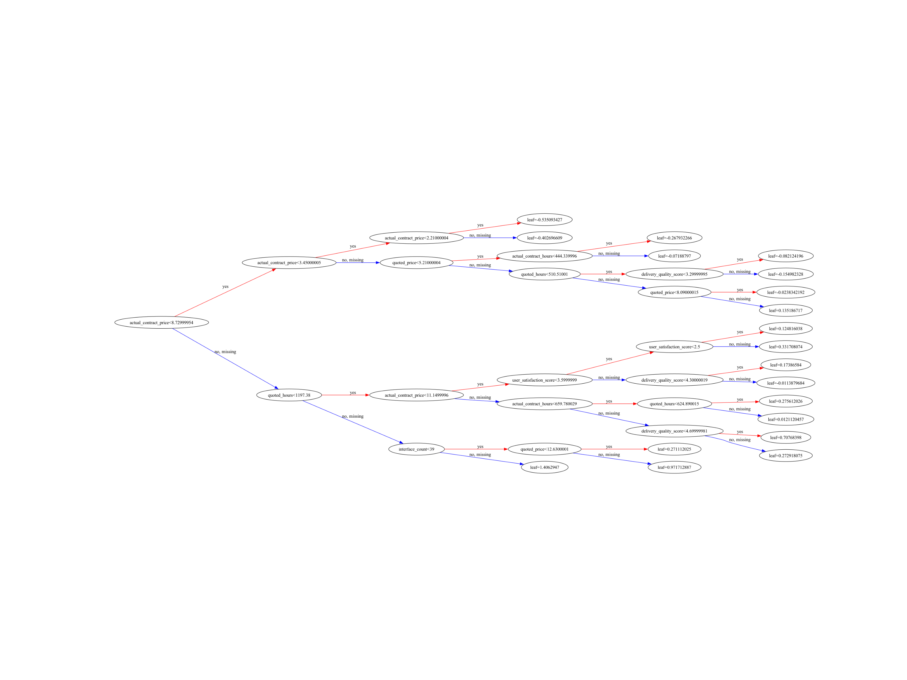

# 人工智能之机器学习-XGBoost学习与使用

category: ai
type: Post
status: Published
date: 2025/07/14
slug: /ai/base/ml/XGBoost
summary: XGBoost学习与使用
tags: 决策树, 机器学习, 集成学习

<aside>
💡 *我是任伟Ravey，*10年资深编程开发经验的工程师，带你走进ai的世界。如果你觉得文章对你有帮助*，也欢迎你和我一起探讨ai技术。我的邮箱rw_3306@163.com，微信号Ravey6379，博客：https://blog.ravey.site*

</aside>

## 背景

最近在做一个项目，在当前的商业环境中，企业面临着大量的外包项目开发需求。当涉及第三方系统交付时，第三方供应商会提供工时评估和报价。然而，如何判断这些工时和价格的合理性一直是企业管理中的一个重要挑战。传统的评估方法往往依赖于经验判断，缺乏客观的数据支撑，容易导致成本控制不当和决策失误。项目的目标是，**构建一个基于人工智能和机器学习技术的智能评估系统**，通过分析企业积累的大量历史报价和成交合同数据，为新的项目报价提供客观、准确的合理性判断。该系统不仅适用于IT开发项目，还可以扩展到企业其他业务领域的报价评估。

我们知道数据将包含数值型、类别型和文本型特征，并且目标是预测连续值（工时和价格），因此这是一个**回归问题**。考虑到业务场景对模型性能和可解释性的要求，我们将重点考虑以下几类模型：

1. **集成学习模型 (Ensemble Learning Models)：**
    - **优势：** 在处理结构化数据方面表现出色，鲁棒性强，对异常值和缺失值有一定的容忍度，且通常具有较好的可解释性（可以通过特征重要性来理解模型决策）。
    - **候选模型：**
        - **XGBoost (eXtreme Gradient Boosting)：** 性能强大，广泛应用于各种回归和分类任务，支持并行计算，具有正则化功能以防止过拟合。
        - **LightGBM (Light Gradient Boosting Machine)：** 微软开发，在速度和内存使用方面优于XGBoost，尤其适用于大规模数据集。
        - **Random Forest (随机森林)：** 通过构建多棵决策树并取平均来提高预测精度和稳定性，不易过拟合，可解释性好。
2. **线性模型 (Linear Models)：**
    - **优势：** 简单、快速、可解释性极强，可以作为基线模型。
    - **候选模型：**
        - **Linear Regression (线性回归)：** 最基本的回归模型，适用于特征与目标之间存在线性关系的情况。
        - **Ridge/Lasso Regression (岭回归/Lasso回归)：** 带有正则化的线性回归，可以防止过拟合，Lasso还能进行特征选择。
3. **神经网络 (Neural Networks)：**
    - **优势：** 能够学习复杂的非线性关系，尤其在处理大量数据和高维特征时表现优异。对于文本特征（通过嵌入层）有天然的优势。
    - **候选模型：**
        - **多层感知机 (MLP)：** 适用于结构化数据，可以通过增加层数和神经元数量来捕捉复杂模式。
        - **结合文本嵌入的神经网络：** 如果文本特征（项目描述）对预测结果影响显著，可以考虑使用预训练的文本嵌入模型（如BERT、Word2Vec）将文本转换为向量，然后将这些向量与其他结构化特征一起输入到MLP中。

**初步选择：** 考虑到项目的实际需求，我们倾向于优先尝试**集成学习模型（XGBoost）**。它们在实际项目中表现稳定，性能优异，并且提供了特征重要性等可解释性工具，这对于业务人员理解模型决策和进行报价分析至关重要。同时，可以考虑将**线性回归**作为基线模型进行对比。如果文本特征的重要性非常高，且集成模型表现不佳，再考虑引入**神经网络**

## 集成学习模型

在医学诊断中，如果一个病人的病情复杂，通常不会只让一个医生拍板，而是组织 **多位专家组成的会诊小组**，他们来自不同领域（如放射科、外科、肿瘤科、免疫学等），每人从自己的角度给出判断，最后 **综合所有专家意见**，做出最稳妥、准确的诊断决策。

再举一个比较贴切的例子：

> 在风高浪急的海面，一艘船容易偏航或受损。但一支船队（如3~5艘船）结伴航行，彼此保持通信和感知共享：
> 
- 某艘船偏离航向 → 其他船拉回来
- 有船设备失灵 → 其他船冗余补位
- 多船同时感知、判断风浪方向 → 更稳健决策

最终结果是：**船队比单船更能穿越恶劣环境，成功概率大大提升**

**集成学习正是使用多个个体学习器来获得比每个单独学习器更好的预测性能。**

集成学习方法可以分为两类：个体学习器间存在强依赖关系的**串行化方法，数据使用机制被称为提升（Boosting）和个体学习器之间不存在强依赖关系并行化方法，数据使用机制被称为打包（Bagging）**

## **XGBoost**

我们今天的主角**XGBoost**就属于集成学习中的并行化方法**。**

**XGBoost（Extreme Gradient Boosting）** 是一种高效、可扩展的 **梯度提升树（GBDT）框架**，以其在 kaggle 竞赛和工业界中的强大性能著称。

- 属于 **集成学习中的 Boosting 方法**
- 核心是对一系列决策树的加权组合
- 优点：
    - 精度高、泛化能力强
    - 训练速度快（支持并行、缓存优化）
    - 支持处理缺失值、类别特征、特征重要性评估
    - 可用于回归、分类、排序等任务

一般中等规模的数据`10,000 行 × 50 特征`：适合 XGBoost。

### **XGBoost中多个个体学习器是什么？**

在 **XGBoost** 中，多个个体学习器（Weak Learners）指的是一棵棵**回归树（CART：Classification And *Regression* Trees）**。这些树通过串行“纠错”逐步学习，最终组成一个强预测模型。我们来详细讲清楚它的组成与参数调控方式：

本质：**一组串联构建的回归树（CART）**

- 每一棵树都是为**纠正前面模型的残差（预测误差**）而训练的
- 每棵树输出一个预测值（不是分类，而是数值）
- 所有树的加权输出之和，才是最终预测结果

> 这就是 Boosting 的思想：后者改前者错，像“复读机”一样不断纠偏。
> 

---

### XGBoost 树的训练流程简化图示

```python

  y真实值 ≈ Tree1(x) + Tree2(x) + Tree3(x) + ... + TreeN(x)
                ↑         ↑         ↑           ↑
            初步预测   修正误差   再修正       最终预测
```

- 第1棵树先预测
- 后面的树看前面哪里错了 → 预测残差 → 不断修正
- 最终输出 = 所有树的输出之和

### 关键参数解释与调优建议

**模型结构参数（控制个体学习器）**

| 参数名 | 说明 | 常用建议值 |
| --- | --- | --- |
| `n_estimators` | 树的数量（也叫 boosting round） | 100~1000，需调参 |
| `max_depth` | 每棵树的最大深度（复杂度） | 3~10；越大越容易过拟合 |
| `learning_rate` | 学习率（每棵树的“权重”） | 通常 0.01~0.3；越小越稳 |
| `min_child_weight` | 节点最小样本权重和（防止过拟合） | 默认1，越大越保守 |
| `gamma` | 节点分裂最小损失减少值（越大越保守） | 0~10，小数据可略大些 |
| `subsample` | 每轮训练使用的样本比例 | 0.5~1.0；防过拟合 |
| `colsample_bytree` | 每棵树使用的特征比例 | 0.5~1.0；防过拟合 |
| `reg_alpha` / `reg_lambda` | L1 / L2 正则 | 通常调大可防过拟合 |

---

### 优化参数（与训练性能相关）

| 参数名 | 说明 | 常用值建议 |
| --- | --- | --- |
| `objective` | 目标函数，如`reg:squarederror` | 回归问题就选 squarederror |
| `n_jobs` | 并行线程数 | -1 表示自动使用全部核心 |
| `random_state` | 控制随机性，提高可复现性 | 建议设为固定值（如 42） |
|  |  |  |

---

### 调参建议（经验路径）

| 调参顺序 | 调整目标 | 推荐做法 |
| --- | --- | --- |
| 第一步 | 找到合适的 `max_depth`, `min_child_weight` | 控制模型复杂度 |
| 第二步 | 调整 `gamma`, `subsample`, `colsample_bytree` | 增强泛化能力 |
| 第三步 | 降低 `learning_rate`，增大 `n_estimators` | 提升稳定性 |
| 第四步 | 使用交叉验证调 `reg_alpha` 和 `reg_lambda` | 控制过拟合 |

> 小数据集：max_depth 不宜太深（35），learning_rate 适中（0.050.1）
> 
> 
> 大数据集：树可以深一些，n_estimators 多一些，但注意时间成本
> 

---

### 如何查看和可视化每棵树？

XGBoost 内置了模型查看方法：

```python
import joblib
import xgboost as xgb
import matplotlib.pyplot as plt

model = joblib.load("cost_model.pkl")
xgb.plot_tree(model, tree_idx=0, rankdir='LR')

plt.savefig("tree_0.png", dpi=500)
print("Tree saved as tree_0.png")

```



核心的模型训练代码train_model.py

```python

import pandas as pd
import xgboost as xgb
from sklearn.model_selection import train_test_split
from sklearn.metrics import mean_absolute_error
import joblib
import numpy as np
import matplotlib.pyplot as plt

def train():
    """
    Loads the processed data, trains two separate XGBoost models for hours and cost,
    evaluates them, and saves the trained models to disk.
    """
    print("Starting model training process...")

    # 1. Load the processed data
    try:
        data_path = "./processed_modeling_data.csv"
        df = pd.read_csv(data_path)
        print(f"Successfully loaded processed data from {data_path}. Shape: {df.shape}")
    except FileNotFoundError:
        print(f"Error: Processed data file not found at {data_path}.")
        print("Please run the data_processor.py script first.")
        return

    # 2. Define features (X) and targets (y)
    # We will predict 'target_hours' and 'target_cost'
    # All other columns will be used as features, except for identifiers
    
    # Ensure target columns exist
    if 'target_hours' not in df.columns or 'target_cost' not in df.columns:
        print("Error: Target columns ('target_hours', 'target_cost') not found in the data.")
        return

    # Drop non-feature columns
    features = df.drop(columns=['target_hours', 'target_cost', 'quote_id', 'project_id', 'vendor_id', 'actual_id', 'status'])
    
    # Ensure all feature columns are numeric. This is a safeguard.
    # XGBoost requires numeric inputs.
    features = features.select_dtypes(include=np.number)
    
    target_hours = df['target_hours']
    target_cost = df['target_cost']

    print(f"Features for training: {features.columns.tolist()}")

    # --- Train Model for Target Hours ---
    print("\n--- Training model for Target Hours ---")
    
    # 3. Split data for the hours model
    X_train_h, X_test_h, y_train_h, y_test_h = train_test_split(
        features, target_hours, test_size=0.2, random_state=42
    )

    # 4. Initialize and train the XGBoost Regressor for hours
    hours_model = xgb.XGBRegressor(
        objective='reg:squarederror',
        n_estimators=100,
        learning_rate=0.1,
        max_depth=5,
        subsample=0.8,
        colsample_bytree=0.8,
        random_state=42,
        n_jobs=-1 # Use all available CPU cores
    )
    
    print("Training hours model...")
    hours_model.fit(X_train_h, y_train_h)

    # 5. Evaluate the hours model
    print("Evaluating hours model...")
    predictions_h = hours_model.predict(X_test_h)
    mae_h = mean_absolute_error(y_test_h, predictions_h)
    print(f"Mean Absolute Error (Hours Model): {mae_h:.2f} hours")

    # 6. Save the hours model
    joblib.dump(hours_model, 'hours_model.pkl')
    print("Hours model saved to hours_model.pkl")

    # --- Train Model for Target Cost ---
    print("\n--- Training model for Target Cost ---")

    # 3. Split data for the cost model
    X_train_c, X_test_c, y_train_c, y_test_c = train_test_split(
        features, target_cost, test_size=0.2, random_state=42
    )

    # 4. Initialize and train the XGBoost Regressor for cost
    cost_model = xgb.XGBRegressor(
        objective='reg:squarederror',
        n_estimators=100,
        learning_rate=0.1,
        max_depth=5,
        subsample=0.8,
        colsample_bytree=0.8,
        random_state=42,
        n_jobs=-1
    )
    
    print("Training cost model...")
    cost_model.fit(X_train_c, y_train_c)

    # 5. Evaluate the cost model
    print("Evaluating cost model...")
    predictions_c = cost_model.predict(X_test_c)
    mae_c = mean_absolute_error(y_test_c, predictions_c)
    print(f"Mean Absolute Error (Cost Model): {mae_c:.2f} (in 10k units)")

    # 6. Save the cost model
    joblib.dump(cost_model, 'cost_model.pkl')
    print("Cost model saved to cost_model.pkl")
    
    print("\nModel training process complete!")

if __name__ == '__main__':
    train()

```

具体代码详见Github：https://github.com/RaveyShare/XGBoostLearnAndUser.git

微信公众号可以获取更多精彩内容欢迎扫码关注

